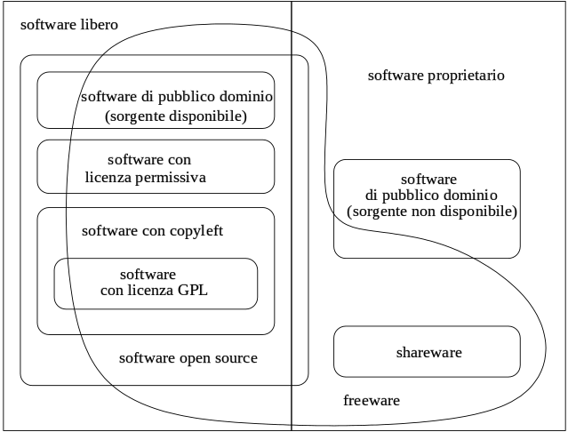

# Licenze software

Quando si utilizza un software, gratuito o a pagamento che sia, il software utilizzato porta con sé sempre una licenza di utilizzo, detta EULA (End-User License Agreement) che specifica il tipo di concessione di licenza del software, le eventuali limitazioni d'uso, le limitazioni di garanzia e di responsabilità.  
Esistono centinaia se non migliaia di tipi diversi di licenze software, in quanto ogni programmatore che scrive un software può decidere di come disporre dei propri diritti e crearsi la propria licenza d'uso.  
In linea di massima esistono 4 tipi di tipologie di licenze

-   Freeware
-   Shareware
-   Proprietarie
-   Open Source

Da un punto di vista legale l'utente che utilizza un software deve avere accettato prima, esplicitamente o implicitamente, le condizioni di licenza.

Le licenze possono essere accettate:

-   durante la fase di installazione del software, quando viene richiesto di accettare la licenza indicata; nel caso non venga accettata la licenza il software non viene installato e non può essere eseguito
-   accettando la licenza su una pagina web, prima di avere la possibilità di eseguire il download del software
-   quando viene aperto il supporto che contiene il software, tipico esempio le etichette adesive che sigillano l'apertura del CD/DVD che contiene il software, la rottura della etichetta implica l'accettazione della licenza (licenza a strappo). 
    

## Le licenze freeware

Le licenze freeware permettono gratuitamente l'utilizzo del software. Bisogna prestare attenzione che la gratuità del prodotto può essere riservata solo agli utenti privati o l'utilizzo da parte di scuole, enti, fondazioni non a scopo di lucro. In molti casi le licenze freeware non concedono il diritto di distribuzione del software, per cui scaricare un software freeware da internet e renderlo disponibile per il download su di un nostro sito può essere un illecito.
  
I programmi distribuiti con licenza freeware sono normalmente eseguibili, per cui l'utilizzatore non ha il diritto vedere il codice sorgente o di modificare il programma in alcun modo, che resta di proprietà dello sviluppatore.

## Le licenze shareware

Le licenze shareware sono delle licenze ad uso limitato nel tempo o nelle funzionalità del software, questo tipo di licenza serve a far conoscere il software, nella speranza che prima o poi l'utilizzatore decida di acquistare la licenza completa del software.

## Licenze proprietarie

Ogni azienda o sviluppatore che decide di vendere un software può decidere quali tipi di diritti concedere con l'acquisto del software. In linea generale viene concessa una licenza d'uso del software, che può avere più o meno restrizioni sull'uso. Di solito le restrizioni principali consistono nel non dare all'utente il codice sorgente, o nel limitarlo nella copia del software o a volte anche su alcuni tipi di utilizzo.

## Open Source

Con il termine open source si intendono quei programmi distribuiti di solito gratuitamente ed utilizzabili anche in ambito commerciale. Per questo tipo di programmi viene distribuito anche il codice sorgente e viene data la possibilità a chiunque lo scarichi di poterlo modificare.  
I programmi open source per potersi definire tali devono permettere le seguenti libertà:

1.  Libertà di poter eseguire il software per qualsiasi scopo.
2.  Libertà di poter studiare il software e anche di poterlo modificare.
3.  Libertà di ridistribuire copie del software.
4.  Libertà di migliorare il software e di distribuirne pubblicamente i miglioramenti.

Le licenze di Software Libero e Open Source più diffuse sono:

1. La **GNU GPL3**: la licenza ideata dal fondatore Richard Stallman per rappresentare al meglio le 4 libertà. L'unico vincolo notevole è di non poter copiare il software senza mettere a disposizione il codice sorgente agli utenti che ne facessero richiesta. Questa limitazione è a volte osteggiata dalle aziende che non possono includere software GPL nei loro programmi proprietari;
2. La **MIT**: che rispetta le 4 libertà e in più può essere distribuita e quindi inclusa in programmi proprietari
3. La **GNU Affero GPL3**: che porta le caratteristiche della GPL3 alle applicazioni web, quindi ogni utente può chiedere il codice sorgente del backend che sta utilizzando con il proprio dispositivo;
4. La **Public Domain**: la licenza "nulla" che consente di fare ciò che desideri al software che hai "sottomano" ;-)

